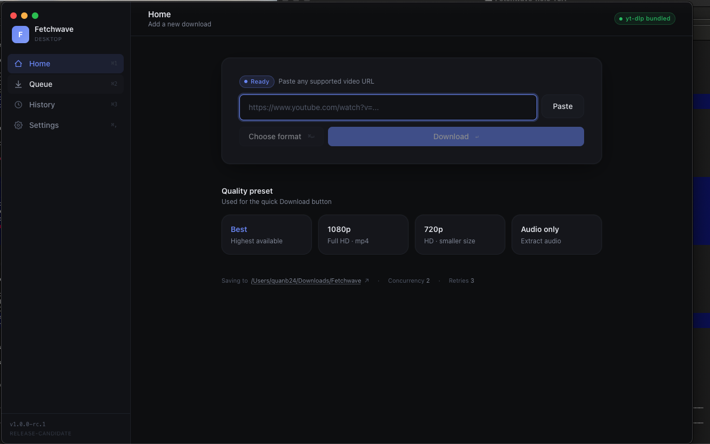
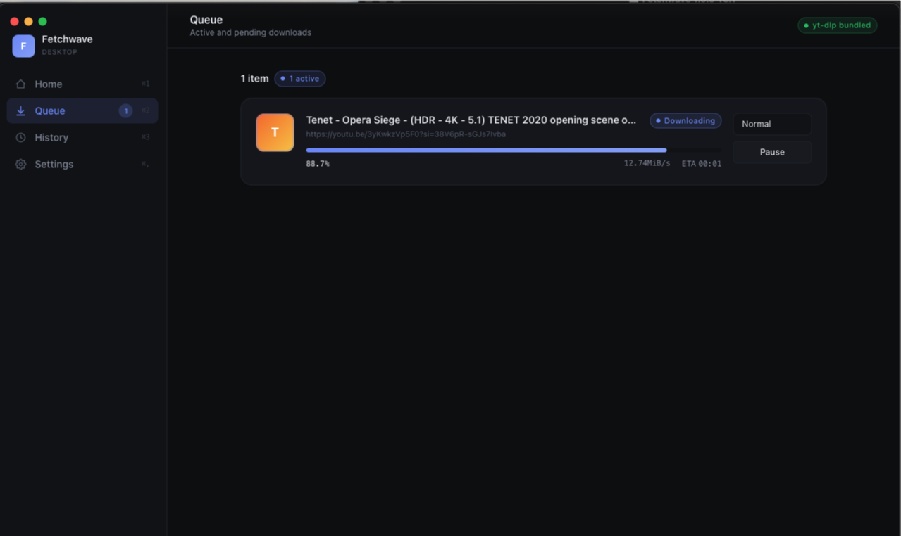
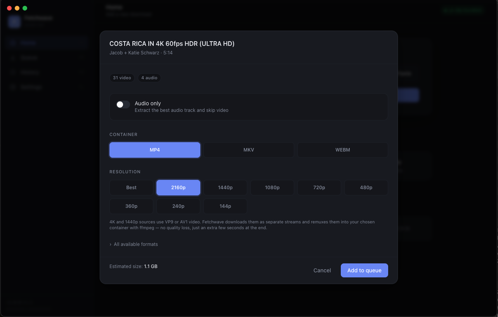
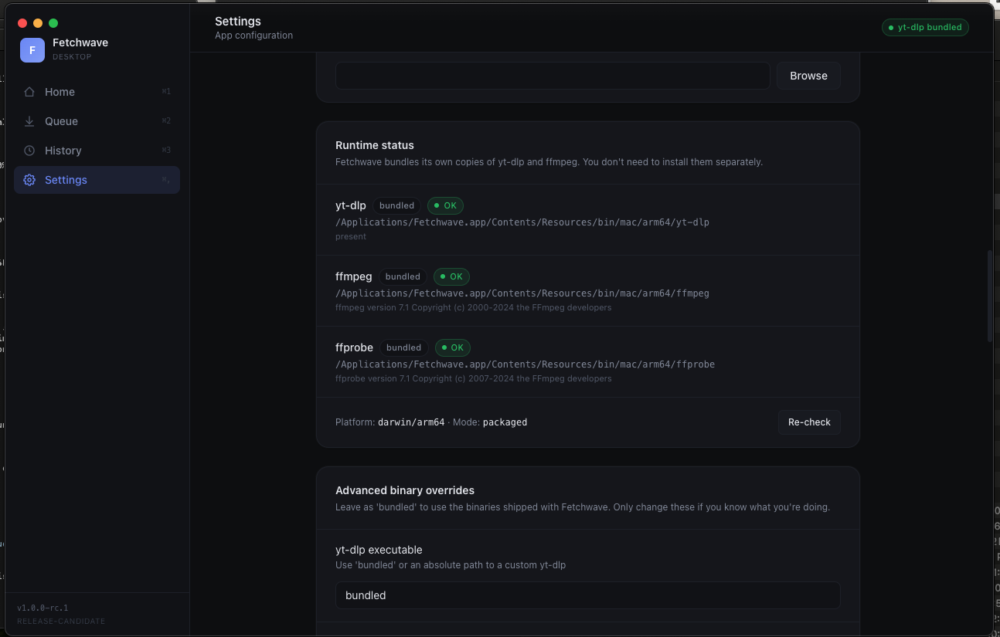

<div align="center">

<br>


# 🌊 Fetchwave

### A premium desktop downloader for the open web

Save videos, playlists, and music from your favorite sites — without ever touching a terminal.

<br>

[](https://github.com/quanb24/fetchwave/releases/latest)
[](https://github.com/quanb24/fetchwave/releases/latest)

<br>


</div>

<br>

---

## ✨ What it is

Fetchwave is a beautiful, calm desktop app for saving video and audio from the open web. **You paste a link, click a button, and the file lands in your downloads folder.** That's it.

It's built on the most powerful video downloader in existence, but wraps it in an interface that anyone can use. **No commands. No Python. No setup.** Just install the app and start downloading.

Whether you want a 4K music video, an entire playlist, or just the audio as an MP3 — Fetchwave handles it in three clicks.

<br>

---

## 🎯 Key features

| | |
|---|---|
| 📦 **Works out of the box** | Install the app and you're ready. Nothing else to download or configure. |
| 🎬 **Real 4K downloads** | Get videos in their original 2160p quality, automatically merged into a clean MP4. |
| 🎵 **Audio extraction** | Convert any video to MP3 with one click. |
| 📋 **Playlists** | Drop in a playlist link and Fetchwave queues every video for you. |
| ⚡ **Smart queue** | Pause, resume, cancel, and prioritize. Your queue survives app restarts. |
| 🎛️ **Format picker** | Choose exact resolution, container, or audio-only — or let Fetchwave pick the best. |
| 🔧 **Self-healing** | If something breaks, Fetchwave fixes itself with one click. |
| ♻️ **Auto-updates** | New versions install themselves in the background. |
| 🌙 **Calm interface** | Designed to feel premium, not cluttered. |
| 🔒 **Private by design** | Everything runs locally. No accounts. No cloud. No tracking. |

<br>

---

## 📸 Screenshots

<table>
<tr>
<td align="center" width="50%">

<br><b>Home</b><br>
<sub>Paste a link, pick a quality preset</sub>
</td>
<td align="center" width="50%">

<br><b>Queue</b><br>
<sub>Watch your downloads in real time</sub>
</td>
</tr>
<tr>
<td align="center" width="50%">

<br><b>Format Picker</b><br>
<sub>Choose exactly what you want</sub>
</td>
<td align="center" width="50%">

<br><b>Settings</b><br>
<sub>Everything in one place</sub>
</td>
</tr>
</table>

<br>

---

## ⬇️ Download

<div align="center">

### **[Get the latest version →](https://github.com/quanb24/fetchwave/releases/latest)**

</div>

Pick the file that matches your computer:

| Your computer | File to download |
|---|---|
| 🪟 **Windows 10 / 11** | `Fetchwave-x.x.x-win-x64.exe` |
| 🍎 **Mac · Apple Silicon** *(M1, M2, M3, M4)* | `Fetchwave-x.x.x-mac-arm64.dmg` |
| 🍎 **Mac · Intel chip** | `Fetchwave-x.x.x-mac-x64.dmg` |

> [!TIP]
> **Not sure which Mac you have?** Click the Apple logo in the top-left of your screen → **About This Mac**. If it mentions "Apple M1, M2, M3, or M4" — pick the **arm64** file. If it says "Intel" — pick the **x64** file.

<br>

---

## 🚀 How it works

Three clicks. That's the entire app.

<table>
<tr>
<td width="33%" align="center" valign="top">
<h3>1️⃣</h3>
<b>Paste a link</b><br>
<sub>Copy any video URL from your browser and paste it into Fetchwave.</sub>
</td>
<td width="33%" align="center" valign="top">
<h3>2️⃣</h3>
<b>Pick a format <sup>(optional)</sup></b><br>
<sub>Click <b>Choose format</b> for a specific resolution, or just hit <b>Download</b>.</sub>
</td>
<td width="33%" align="center" valign="top">
<h3>3️⃣</h3>
<b>Download</b><br>
<sub>The file lands in your downloads folder. Click <b>Open file</b> to play it.</sub>
</td>
</tr>
</table>

<br>

---

## 💡 A real example

Let's say you want to save a music video as an MP3:

1. Open the music video in your browser and copy the link
2. Open Fetchwave
3. Click the **Audio only** preset on the home screen
4. Paste the link and click **Download**
5. A few seconds later, your `.mp3` is in `~/Downloads/Fetchwave/`

**Want the full 4K video instead?** Click **Choose format**, pick **2160p**, hit **Add to queue**. Same idea.

<br>

---

## 🚦 First launch

Because Fetchwave is a brand-new independent app, your computer hasn't seen it before and will show a small one-time warning the first time you open it. **This is completely normal** — every new app gets this until it's been around long enough.

> [!NOTE]
> You only need to do this once. After the first launch, Fetchwave opens like any other app.

### 🍎 On macOS

1. Drag Fetchwave from the DMG into your **Applications** folder
2. Open Applications and **right-click** Fetchwave → **Open**
3. Click **Open** in the dialog that appears

### 🪟 On Windows

1. Double-click the `.exe` installer
2. If you see *"Windows protected your PC"*, click **More info** → **Run anyway**
3. Click through the installer (Next → Install → Finish)

<br>

---

## ♻️ Updates

Fetchwave checks for new versions a few seconds after launch and downloads them quietly in the background. When an update is ready, you'll see a small notification at the top of the app — click **Restart & install** and you're done.

You can also check manually anytime in **Settings → Updates**.

<br>

---

## 🆘 Support

Something not working? Found a bug? Have an idea?

<div align="center">

### **[Open an issue →](https://github.com/quanb24/fetchwave/issues)**

</div>

> [!TIP]
> For technical issues, Fetchwave keeps a detailed log of everything that happens. Open **Settings → Logs → Export logs** and attach the file to your issue — that gives us everything we need to help you fast.

<br>

---

## 🛠️ For developers

<details>
<summary><b>Build from source · click to expand</b></summary>

<br>

**Requirements:** Node.js 20+, macOS / Windows / Linux

**Setup:**
```bash
git clone https://github.com/quanb24/fetchwave.git
cd fetchwave
npm install
./scripts/fetch-binaries.sh        # macOS / Linux
.\scripts\fetch-binaries.ps1       # Windows PowerShell
npm run dev
```

**Build & release:**
```bash
npm run build              # type-check + build everything
npm run package:mac        # build a macOS .dmg locally
npm run package:win        # build a Windows .exe (must run on Windows)

npm run release:patch      # 1.0.0 → 1.0.1, push tag, CI ships installers
npm run release:rc         # cut a release candidate
```

Pushing a `vX.Y.Z` tag automatically triggers GitHub Actions, which builds Mac and Windows installers in parallel and publishes them to the [Releases](https://github.com/quanb24/fetchwave/releases) page.

**Architecture:**
```
electron/   Main process — window, IPC, queue, yt-dlp orchestration
src/        Renderer — React + TypeScript UI
resources/  Bundled binaries (yt-dlp, ffmpeg, ffprobe) per platform
assets/     Icons and screenshots
```

Built with **Electron · React · TypeScript · Vite · Tailwind · Zustand**.

</details>

<br>

---

## 🙌 Credits

Fetchwave is a polished interface around two extraordinary open-source projects:

- **[yt-dlp](https://github.com/yt-dlp/yt-dlp)** — the engine that makes downloading possible. Fetchwave bundles and orchestrates yt-dlp; we are not affiliated with the yt-dlp project.
- **[FFmpeg](https://ffmpeg.org)** — used to merge video and audio streams into clean output files.

Huge thanks to the maintainers of both. Without them, Fetchwave would not exist.

<br>

---

## 📜 License

MIT — see [LICENSE](./LICENSE).

The bundled `yt-dlp` and `ffmpeg` binaries retain their original licenses (Unlicense and LGPL/GPL respectively).

<br>

---

<div align="center">

## ⭐ One last thing

Fetchwave is designed to feel **simple and safe.**

If you ever feel lost, the answer is almost always:

**Settings → Self-heal → Repair runtime**

That single button fixes most things.

<br>

If Fetchwave makes your life a little easier, **[give it a star ⭐](https://github.com/quanb24/fetchwave)** — it genuinely helps the project grow.

<br>

[](https://github.com/quanb24/fetchwave/releases/latest)
[](https://github.com/quanb24/fetchwave/issues)
[](https://github.com/quanb24/fetchwave)

<br>

Made with care for everyone tired of bad downloaders.

</div>
